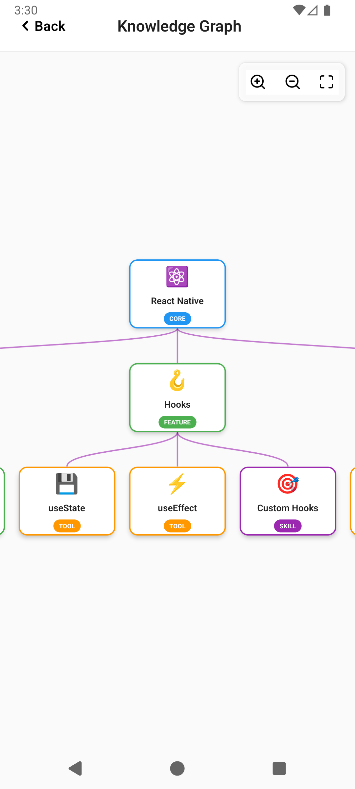
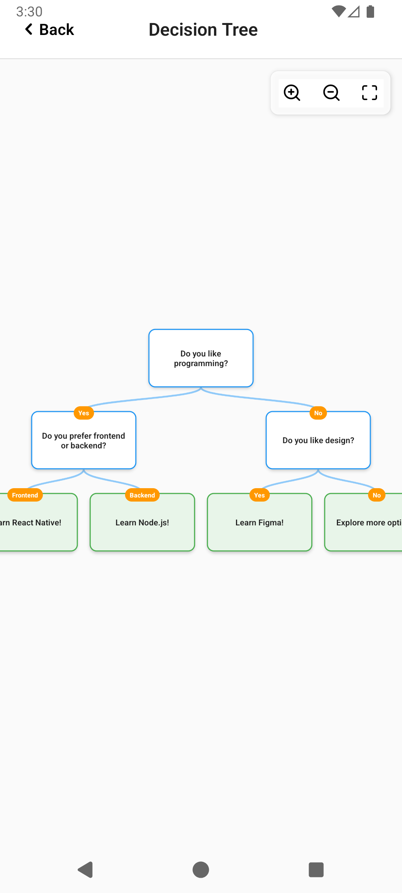

# RNFlow

A powerful React Native component for creating interactive tree diagrams and flow visualizations.

[](https://www.npmjs.com/package/react-native-rnflow)
[](./LICENSE)
[](https://www.typescriptlang.org/)

---

## Table of Contents

- [Installation](#installation)
- [How to Use](#how-to-use)
- [Props Reference](#props-reference)
- [Screenshots](#screenshots)
- [Examples](#examples)
- [Troubleshooting](#troubleshooting)
- [Performance](#performance)
- [Contributing](#contributing)
- [License](#license)

---

## Installation

### 1. Install the package

```bash
npm install react-native-rnflow react-native-svg react-native-gesture-handler react-native-reanimated
```

**Optional (for icons):**
```bash
npm install react-native-vector-icons
```

### 2. Configure Babel

Add to your `babel.config.js`:

```javascript
module.exports = {
  presets: ['module:metro-react-native-babel-preset'],
  plugins: [
    'react-native-reanimated/plugin', // MUST be last
  ],
};
```

### 3. Configure Gesture Handler

Add to the **top** of your `index.js`:

```javascript
import 'react-native-gesture-handler';
```

### 4. iOS Setup

Install pods:
```bash
cd ios && pod install && cd ..
```

If using vector icons, add to `Info.plist`:
```xml
<key>UIAppFonts</key>
<array>
  <string>MaterialIcons.ttf</string>
  <string>Feather.ttf</string>
</array>
```

### 5. Android Setup

**Update `MainActivity.java` or `MainActivity.kt`:**

Java:
```java
import android.os.Bundle;

@Override
protected void onCreate(Bundle savedInstanceState) {
    super.onCreate(null);
}
```

Kotlin:
```kotlin
import android.os.Bundle

override fun onCreate(savedInstanceState: Bundle?) {
    super.onCreate(null)
}
```

If using vector icons, add to `android/app/build.gradle`:
```gradle
apply from: "../../node_modules/react-native-vector-icons/fonts.gradle"
```

### 6. Rebuild

```bash
npx react-native run-ios
# or
npx react-native run-android
```

---

## How to Use

### Basic Example

```tsx
import RNFlow, { RNFlowNode } from 'react-native-rnflow';

const data: RNFlowNode = {
  id: '1',
  data: { title: 'CEO' },
  children: [
    { id: '2', data: { title: 'CTO' } },
    { id: '3', data: { title: 'CFO' } },
  ],
};

function App() {
  return <RNFlow data={data} />;
}
```

### With Custom Styling

```tsx
<RNFlow
  data={data}
  layout={{
    direction: 'horizontal',
    nodeWidth: 180,
    nodeHeight: 100,
  }}
  style={{
    backgroundColor: '#F5F7FA',
    edgeStyle: {
      stroke: '#64B5F6',
      strokeWidth: 2,
    },
  }}
  edgeType="smoothstep"
/>
```

### With Custom Icons

```tsx
import Icon from 'react-native-vector-icons/MaterialIcons';

<RNFlow
  data={data}
  zoom={{
    iconComponent: Icon,
    iconColor: '#2196F3',
    iconSize: 24,
  }}
/>
```

### With Interactions

```tsx
const [selectedIds, setSelectedIds] = useState<string[]>([]);

<RNFlow
  data={data}
  selectedNodeIds={selectedIds}
  interaction={{
    onNodePress: (node) => {
      setSelectedIds([node.id]);
      console.log('Pressed:', node.data.title);
    },
    onZoomChange: (zoom) => console.log('Zoom:', zoom),
  }}
/>
```

### With Custom Node Rendering

```tsx
<RNFlow
  data={data}
  render={{
    renderNode: (node, { isSelected, onPress, dimensions }) => (
      <TouchableOpacity
        onPress={onPress}
        style={{
          width: dimensions.width,
          height: dimensions.height,
          backgroundColor: isSelected ? '#E3F2FD' : '#FFF',
          borderRadius: 12,
          padding: 16,
        }}
      >
        <Text style={{ fontWeight: 'bold' }}>{node.data.title}</Text>
      </TouchableOpacity>
    ),
  }}
/>
```

---

## Props Reference

### Core Props

| Prop | Type | Required | Description |
|------|------|----------|-------------|
| `data` | `RNFlowNode` | Yes | Root node of tree |
| `selectedNodeIds` | `string[]` | No | Array of selected node IDs |

### Layout Configuration

**Usage:** `layout={{ ... }}`

| Property | Type | Default | Description |
|----------|------|---------|-------------|
| `direction` | `'vertical' \| 'horizontal'` | `'vertical'` | Tree direction |
| `nodeWidth` | `number` | `120` | Node width (px) |
| `nodeHeight` | `number` | `56` | Node height (px) |
| `levelGap` | `number` | `140` | Gap between levels |
| `siblingGap` | `number` | `160` | Gap between siblings |
| `padding` | `number` | `200` | Canvas padding |
| `alignment` | `'start' \| 'center' \| 'end'` | `'center'` | Alignment |

Example:
```tsx
layout={{ direction: 'horizontal', nodeWidth: 180, levelGap: 200 }}
```

### Zoom Configuration

**Usage:** `zoom={{ ... }}`

| Property | Type | Default | Description |
|----------|------|---------|-------------|
| `minZoom` | `number` | `0.1` | Minimum zoom level |
| `maxZoom` | `number` | `3` | Maximum zoom level |
| `defaultZoom` | `number` | `1` | Initial zoom |
| `enablePinchZoom` | `boolean` | `true` | Enable pinch gesture |
| `enableZoomControls` | `boolean` | `true` | Show zoom buttons |
| `showZoomInButton` | `boolean` | `true` | Show zoom in |
| `showZoomOutButton` | `boolean` | `true` | Show zoom out |
| `showResetButton` | `boolean` | `true` | Show reset |
| `zoomControlsPosition` | `'top-left' \| 'top-right' \| 'bottom-left' \| 'bottom-right'` | `'top-right'` | Button position |
| `iconComponent` | `React.Component` | - | Custom icon component |
| `iconSize` | `number` | `20` | Icon size |
| `iconColor` | `string` | `'#000'` | Icon color |

Example:
```tsx
zoom={{ 
  minZoom: 0.5, 
  maxZoom: 2, 
  iconComponent: MaterialIcon,
  iconColor: '#2196F3' 
}}
```

### Scroll Configuration

**Usage:** `scroll={{ ... }}`

| Property | Type | Default | Description |
|----------|------|---------|-------------|
| `hideScrollBars` | `boolean` | `false` | Hide scrollbars |
| `autoCenter` | `boolean` | `true` | Auto-center on mount |
| `bounces` | `boolean` | `true` | Enable bounce effect |

### Interaction Configuration

**Usage:** `interaction={{ ... }}`

| Property | Type | Description |
|----------|------|-------------|
| `onNodePress` | `(node: RNFlowNode) => void` | Node press callback |
| `onNodeLongPress` | `(node: RNFlowNode) => void` | Long press callback |
| `onZoomChange` | `(zoom: number) => void` | Zoom change callback |
| `onScrollChange` | `(x: number, y: number) => void` | Scroll callback |

Example:
```tsx
interaction={{
  onNodePress: (node) => console.log(node.id),
  onZoomChange: (zoom) => console.log(zoom),
}}
```

### Render Configuration

**Usage:** `render={{ ... }}`

| Property | Type | Description |
|----------|------|-------------|
| `renderNode` | Function | Custom node renderer |
| `renderEdge` | Function | Custom edge renderer |
| `renderZoomControls` | Function | Custom zoom controls |

**renderNode signature:**
```typescript
(node: RNFlowNode, options: {
  isSelected: boolean;
  onPress: () => void;
  onLongPress: () => void;
  dimensions: { width: number; height: number };
}) => ReactNode
```

### Style Configuration

**Usage:** `style={{ ... }}`

| Property | Type | Default | Description |
|----------|------|---------|-------------|
| `backgroundColor` | `string` | `'#F5F5F5'` | Container background |
| `canvasBackgroundColor` | `string` | `'transparent'` | Canvas background |
| `nodeStyle` | `object` | - | Default node style |
| `selectedNodeStyle` | `object` | - | Selected node style |
| `edgeStyle` | `object` | - | Edge style |
| `containerStyle` | `ViewStyle` | - | Container style |

**Node style properties:**
- `backgroundColor`, `borderColor`, `borderWidth`, `borderRadius`
- `shadowColor`, `shadowOpacity`, `shadowRadius`, `elevation`

**Edge style properties:**
- `stroke`, `strokeWidth`, `strokeDasharray`, `opacity`

Example:
```tsx
style={{
  backgroundColor: '#1E1E1E',
  nodeStyle: {
    backgroundColor: '#3A3A3A',
    borderRadius: 12,
    borderColor: '#555',
    borderWidth: 1,
  },
  edgeStyle: {
    stroke: '#666',
    strokeWidth: 2,
  },
}}
```

### Edge Types

| Prop | Type | Default | Description |
|------|------|---------|-------------|
| `edgeType` | `'straight' \| 'curved' \| 'step' \| 'smoothstep'` | `'step'` | Edge rendering style |

Example:
```tsx
edgeType="smoothstep"
```

### Debug

| Prop | Type | Default | Description |
|------|------|---------|-------------|
| `debug` | `boolean` | `false` | Show debug overlay |

---

## Screenshots

<table>
<tr>
<td align="center">

<br />
<b>Organization Chart</b>
<br />
Company hierarchies
</td>
<td align="center">

<br />
<b>Family Tree</b>
<br />
Genealogy tracking
</td>
<td align="center">

<br />
<b>Knowledge Graph</b>
<br />
Learning paths
</td>
</tr>
<tr>
<td align="center">

<br />
<b>Decision Tree</b>
<br />
Interactive flowcharts
</td>
<td align="center">

<br />
<b>File System</b>
<br />
Directory structures
</td>
</tr>
</table>

---

## Examples

We provide 21+ ready-to-use examples covering various use cases:

### Basic Examples
- **Simple Tree** - Get started quickly
- **Horizontal Layout** - Left-to-right flow
- **Edge Types** - Different connection styles

### Business Use Cases
- **Organization Chart** - Company hierarchies with employee cards
- **Project Roadmap** - Timeline with milestones and status tracking
- **Network Diagram** - Infrastructure mapping with dark theme
- **Decision Tree** - Interactive flowcharts with path tracking

### Personal Projects
- **Family Tree** - Genealogy with photos and dates
- **File System** - Directory browser with icons
- **Shopping Categories** - E-commerce with discount badges

### Educational
- **Knowledge Graph** - Learning paths with difficulty levels
- **Mind Map** - Concept relationships

### Styling
- **Dark Theme** - Complete dark mode implementation
- **Minimalist** - Clean black and white design

### Advanced
- **Multi-Select** - Batch operations with action bar
- **Custom Icons** - Different icon libraries
- **Custom Edges** - Arrow markers and labels

**[📁 View All Examples & Code](./examples/README.md)**

**[🎮 Run Interactive Demo App](./SETUP_GUIDE.md)**

---

## Troubleshooting

### Gestures not working

**Problem:** Touch gestures don't respond

**Solution:**

1. Add to **top** of `index.js`:
```javascript
import 'react-native-gesture-handler';
```

2. Update MainActivity (Android):
```java
@Override
protected void onCreate(Bundle savedInstanceState) {
    super.onCreate(null);
}
```

3. Clear cache and rebuild:
```bash
npx react-native start --reset-cache
npx react-native run-android
```

---

### Zoom animation not working

**Problem:** Zoom doesn't animate smoothly

**Solution:**

Add to `babel.config.js`:
```javascript
module.exports = {
  plugins: ['react-native-reanimated/plugin'], // Must be last!
};
```

Rebuild:
```bash
npx react-native run-ios
```

---

### Icons not displaying

**Problem:** Custom icons show as empty boxes

**Solution:**

1. Install vector icons:
```bash
npm install react-native-vector-icons
```

2. iOS - Install pods:
```bash
cd ios && pod install && cd ..
```

3. Android - Add to `android/app/build.gradle`:
```gradle
apply from: "../../node_modules/react-native-vector-icons/fonts.gradle"
```

4. Rebuild app

---

### TypeScript errors

**Problem:** Type errors in custom render functions

**Solution:**

Use proper types:
```tsx
import { RNFlowNode } from 'react-native-rnflow';

interface MyData {
  title: string;
  name: string;
}

const data: RNFlowNode<MyData> = {
  id: '1',
  data: { title: 'CEO', name: 'John' },
  children: [],
};
```

---

### Performance issues with large trees

**Problem:** Slow rendering with 100+ nodes

**Solution:**

1. Reduce node complexity:
```tsx
layout={{ nodeWidth: 100, nodeHeight: 60 }}
```

2. Memoize render functions:
```tsx
const renderNode = useMemo(() => 
  (node, options) => <CustomNode {...options} />,
  []
);
```

3. Limit visible depth:
```tsx
const visibleData = filterToDepth(data, 3);
```

---

### White screen on app start

**Problem:** App shows white screen

**Solution:**

1. Check all imports are correct
2. Verify babel config has reanimated plugin
3. Clear metro cache:
```bash
npx react-native start --reset-cache
```

4. Clean build:
```bash
# iOS
cd ios && rm -rf build && pod install && cd ..

# Android
cd android && ./gradlew clean && cd ..
```

---

### Module not found errors

**Problem:** Cannot find 'react-native-reanimated' or other modules

**Solution:**

Reinstall dependencies:
```bash
rm -rf node_modules
npm install
cd ios && pod install && cd ..
```

---

## Performance

### Benchmarks

Our tests show excellent performance across different tree sizes:

| Tree Size | Render Time | FPS | Memory Usage |
|-----------|-------------|-----|--------------|
| 10 nodes | < 100ms | 60 | ~10MB |
| 50 nodes | < 300ms | 60 | ~25MB |
| 100 nodes | < 600ms | 55-60 | ~50MB |
| 500 nodes | < 2s | 50-55 | ~150MB |

### Optimization Tips

**1. Memoize Custom Render Functions**

```tsx
const renderNode = useMemo(
  () => (node, options) => <CustomNode {...node} {...options} />,
  []
);

<RNFlow data={data} render={{ renderNode }} />
```

**2. Keep Node Data Minimal**

❌ Bad:
```tsx
data: {
  title: 'CEO',
  fullBio: '...(large text)...',
  profileImage: '...(base64)...',
  // ... lots of data
}
```

✅ Good:
```tsx
data: {
  title: 'CEO',
  id: '123', // Load details on demand
}
```

**3. Use Appropriate Node Sizes**

For large trees, use smaller nodes:
```tsx
layout={{
  nodeWidth: 100,  // Instead of 200
  nodeHeight: 60,  // Instead of 120
}}
```

**4. Limit Zoom Range**

```tsx
zoom={{
  minZoom: 0.5,  // Instead of 0.1
  maxZoom: 2,    // Instead of 5
}}
```

**5. Disable Features You Don't Need**

```tsx
zoom={{
  enableZoomControls: false,  // If not needed
}}
scroll={{
  hideScrollBars: true,       // Slight performance gain
}}
```

**6. Lazy Load Children**

For very large trees:
```tsx
const [loadedNodes, setLoadedNodes] = useState(initialNodes);

const loadChildren = async (nodeId) => {
  const children = await fetchChildren(nodeId);
  setLoadedNodes(prev => updateWithChildren(prev, nodeId, children));
};
```

**7. Use Production Build**

Development builds are slower. Test performance in production:
```bash
npx react-native run-ios --configuration Release
npx react-native run-android --variant=release
```

---

## Contributing

We welcome contributions from the community!

**[📖 Read Full Contributing Guide](./CONTRIBUTING.md)**

### Quick Guide

1. **Fork** the repository
2. **Create** a feature branch: `git checkout -b feature/amazing-feature`
3. **Commit** changes: `git commit -m 'Add amazing feature'`
4. **Push** to branch: `git push origin feature/amazing-feature`
5. **Open** a Pull Request

### Development Setup

```bash
git clone https://github.com/yourusername/react-native-rnflow.git
cd react-native-rnflow
npm install
npm run build
```

### Running Tests

```bash
npm test
```

### Code Standards

- Use TypeScript
- Follow ESLint rules
- Write tests for new features
- Update documentation

---

## License

MIT License

Copyright (c) 2024 [Your Name]

Permission is hereby granted, free of charge, to any person obtaining a copy
of this software and associated documentation files (the "Software"), to deal
in the Software without restriction, including without limitation the rights
to use, copy, modify, merge, publish, distribute, sublicense, and/or sell
copies of the Software, and to permit persons to whom the Software is
furnished to do so, subject to the following conditions:

The above copyright notice and this permission notice shall be included in all
copies or substantial portions of the Software.

THE SOFTWARE IS PROVIDED "AS IS", WITHOUT WARRANTY OF ANY KIND, EXPRESS OR
IMPLIED, INCLUDING BUT NOT LIMITED TO THE WARRANTIES OF MERCHANTABILITY,
FITNESS FOR A PARTICULAR PURPOSE AND NONINFRINGEMENT. IN NO EVENT SHALL THE
AUTHORS OR COPYRIGHT HOLDERS BE LIABLE FOR ANY CLAIM, DAMAGES OR OTHER
LIABILITY, WHETHER IN AN ACTION OF CONTRACT, TORT OR OTHERWISE, ARISING FROM,
OUT OF OR IN CONNECTION WITH THE SOFTWARE OR THE USE OR OTHER DEALINGS IN THE
SOFTWARE.

**[View Full License](./LICENSE)**

---

## Support & Community

- 🐛 **Report Bugs:** [GitHub Issues](https://github.com/yourusername/react-native-rnflow/issues)
- 📧 **Email:** ankit.ad.dhawan@gmail.com

---

<div align="center">

**Made with ❤️ for the React Native community**

[⬆ Back to Top](#rnflow)

</div>